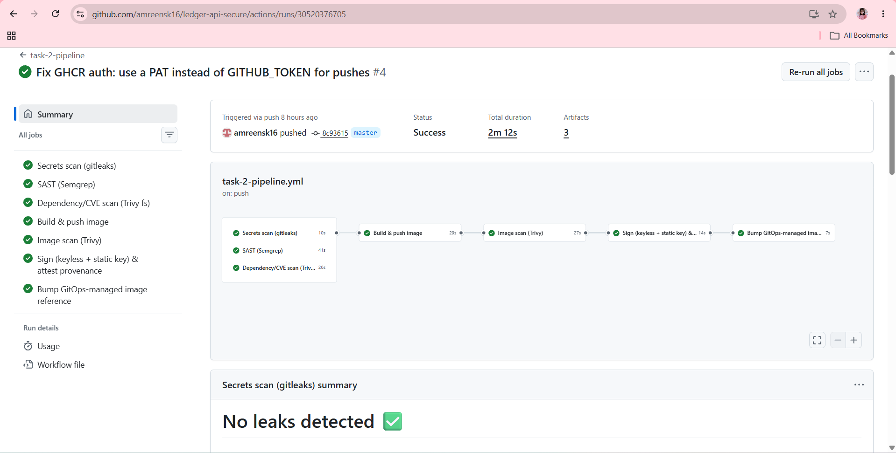
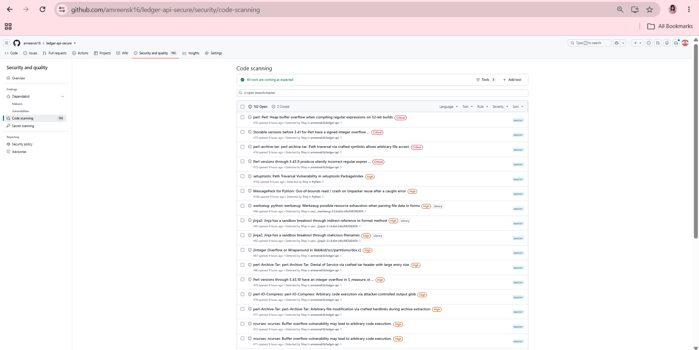
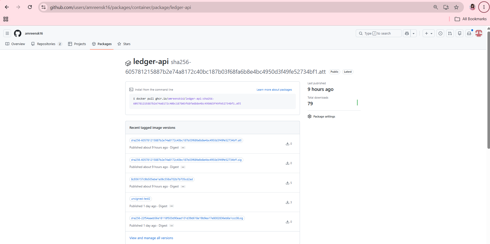

# Task 2 — Secure CI/CD Pipeline & Supply Chain

Rebuilds the delivery path for `ledger-api` (from Task 1) so security is
enforced by the pipeline: real, gating scans; keyless cosign signing + a
SLSA-style provenance attestation; and GitOps (ArgoCD) as the deployment
source of truth, with a demonstrated drift/self-heal cycle.

See `docs/architecture.md` for the pipeline diagram and the two interesting
technical problems hit along the way, and `docs/decisions.md` for the
trade-offs made explicit.

## Why GitOps, specifically

The `kind` cluster this all deploys to exists only on a local developer
machine - GitHub's cloud runners have **no network path to it at all** (no
port-forward, no public endpoint, no cloud account). A CI job can never
`kubectl apply` directly. That makes pull-based GitOps not just the
assignment's preference but the only architecturally viable "deploy" step:
CI ends at committing an image-tag bump to git; ArgoCD, running inside the
cluster, polls and applies it.

## Pipeline — `.github/workflows/task-2-pipeline.yml`

```
secrets-scan (gitleaks) ──┐
sast-semgrep (Semgrep)    ├──> build-push ──> image-scan (Trivy) ──> sign-attest ──> gitops-bump
sca-filesystem (Trivy fs) ┘
```

Every scan job uploads its results as SARIF to the repo's Security tab,
whether it passed or failed (`if: always()`).

## Fail policy per gate

| Gate | Hard-blocks on | Warns (non-blocking) on | CVE with no fix yet |
|---|---|---|---|
| **gitleaks** (secrets) | Any finding outside the allowlist | - | N/A - secrets aren't "no fix yet," they're rotated or they aren't |
| **Semgrep** (SAST) | `ERROR` severity | Lower severities (still uploaded as SARIF) | N/A |
| **Trivy fs / image** (SCA) | CRITICAL/HIGH **with a fix available** (`--ignore-unfixed --exit-code 1`) | A second, informational scan (no `--ignore-unfixed`, `continue-on-error: true`) surfaces everything else for visibility | Two mechanisms: (1) the informational scan makes it visible without blocking; (2) `task-2/trivy/.trivyignore` supports `exp:`-dated exceptions for a *specific, triaged* CVE - once the date passes, Trivy stops honoring the entry and it blocks again, forcing re-triage rather than a silent permanent bypass |
| **cosign sign / attest** | Signing failure (can't publish an unsigned image) | - | N/A |

Real example hit during development: Trivy's blocking scan failed on two
genuinely fixable HIGH CVEs in `setuptools`' vendored `jaraco.context`/`wheel`
(shipped stock in `python:3.11-slim`) - fixed properly by upgrading
`pip`/`setuptools`/`wheel` in the Dockerfile. Two *further* findings
(`msgpack`, `setuptools` again) turned out to be embedded in CPython's own
`ensurepip` bundle and pip's internal vendor directory - static artifacts
never executed by this Flask app at runtime, with no fix available short of
a base-image bump. Those are the two live entries in `.trivyignore` right
now, each with an `exp:` date and documented reasoning - not suppressed
silently.

## Signing: keyless + static key, deliberately dual

Task 2 requires **keyless** cosign signing (OIDC/Fulcio, no key material).
But Task 1's already-deployed Kyverno `require-signed-images` policy only
trusts a **static key pair**. Rather than touch that live policy, this
pipeline signs the image **twice**:

1. **Keyless** (`cosign sign --yes`, tlog upload on) - Task 2's literal
   requirement, immediately verified in the same job
   (`cosign verify --certificate-identity-regexp ... --certificate-oidc-issuer https://token.actions.githubusercontent.com`)
   and saved as evidence (`docs/screenshots/01-cosign-verify-keyless.txt`).
2. **Static key** (`cosign sign --key`, same mechanism as Task 1) - keeps
   the live Kyverno gate satisfied so ArgoCD's sync doesn't get rejected at
   admission.

Why not add a keyless attestor to the Kyverno policy instead? Fulcio certs
are ~10-minute-lived and keyless verification anchors trust to the Rekor
entry's `integratedTime` - skipping that (`ignoreTlog`, the same workaround
Task 1 needed for the same corporate-proxy reason) falls back to checking
wall-clock cert expiry, and ArgoCD's reconciliation + pod scheduling gap can
plausibly exceed 10 minutes. A live admission gate that intermittently fails
depending on timing is worse than not having it. Full reasoning in
`docs/decisions.md`.

## Provenance: hand-rolled, not the official SLSA generator

`sign-attest` builds a predicate JSON (subject digest, builder ID = this
exact workflow's OIDC identity, invocation = repo+commit+entrypoint) and
attaches it with `cosign attest --type slsaprovenance`. The official
`slsa-framework/slsa-github-generator` was considered and rejected: it
stores attestations via the OCI 1.1 Referrers API, the exact mechanism Task
1 already found GHCR doesn't reliably support. Labeled honestly in
`docs/decisions.md` as "SLSA-inspired, self-attested" - not independent-
builder SLSA L3, since the same job that builds the image also attests to
it.

## GitOps

- ArgoCD installed via Helm (`task-2/bootstrap/01-install-argocd.sh`) into
  a new `argocd` namespace.
- One `Application` (`task-2/gitops/application-ledger-api.yaml`) whose
  `source.path` points at the **existing** `task-1/k8s/base` - not a
  duplicated manifest set. ArgoCD adopted the already-running resources on
  first sync (it diffs live vs. git state; it doesn't care who created them).
  `syncPolicy.automated: {prune: true, selfHeal: true}`.
- `task-1/k8s/policies/` (Kyverno) and `task-1/k8s/rbac-personas/` stay out
  of ArgoCD's scope - same tier as other cluster add-ons, installed via
  bootstrap scripts.

### Drift + self-heal, demonstrated

```bash
kubectl scale deployment ledger-api -n payments --replicas=5   # manual, bypasses git
# ArgoCD detects: sync=OutOfSync within one status check
# ArgoCD self-heals: replicas back to 3, sync=Synced, within ~15 seconds - no manual sync run
```

Full captured run: `docs/screenshots/04-drift-and-selfheal.txt`.

## A real cross-task fix: Kyverno's `require-non-root-user` was too broad

Installing ArgoCD's Helm chart hit an unexpected wall: Task 1's
`require-non-root-user` and `disallow-latest-tag` Kyverno policies had no
namespace scope, so they applied cluster-wide - including to ArgoCD's own
install Job in the `argocd` namespace, which failed pre-install. Fixed by
scoping both to `namespaces: ["payments"]`, matching how
`require-signed-images` was already scoped. This is ledger-api's own
guardrail, not a cluster-wide mandate on third-party infrastructure charts
we don't author. Verified this didn't weaken or change any of Task 1's
existing rejection demonstrations, since every one of them targeted the
`payments` namespace already.

## Show it working

| # | What it proves | File |
|---|---|---|
| 1 | Keyless signature verified with full transparency-log backing, straight from the CI job | `docs/screenshots/01-cosign-verify-keyless.txt` |
| 2 | The SLSA-style provenance predicate actually generated | `docs/screenshots/02-slsa-predicate.json` |
| 3 | ArgoCD adopted the existing `payments` resources, synced the CI-built/dual-signed image, Kyverno admitted it | `docs/screenshots/03-argocd-adopted-and-synced.txt` |
| 4 | Manual `kubectl scale` drift detected and self-healed automatically | `docs/screenshots/04-drift-and-selfheal.txt` |
| 5 | Both signatures and the provenance attestation independently verified after the fact | `docs/screenshots/05-verify-signatures-local.txt` |

Screenshots, `screenshots/`:


*secrets-scan → sast → sca → build-push → image-scan → sign-attest → gitops-bump, end to end, `2m12s`.*


*Semgrep and Trivy SARIF results uploaded and browsable from the pipeline's scanning gates.*


*The built image alongside its `.sig` (static-key) and `.att` (SLSA-style provenance) artifacts.*

Reproduce:

```bash
gh run list --workflow task-2-pipeline.yml         # pipeline history
bash task-2/scripts/demo-drift-selfheal.sh
bash task-2/scripts/verify-signatures.sh
```
