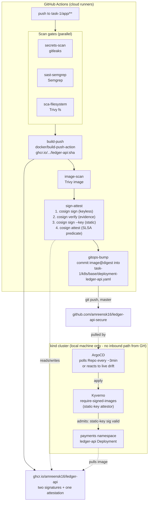

# Architecture

## Why the pipeline can't just `kubectl apply`

The `kind` cluster lives entirely on a local developer machine. GitHub
Actions runners are ephemeral cloud VMs with no route back to that
machine - no port forward, no public IP, no cloud account to bridge them.
A CI job that tried `kubectl apply` would simply have nothing to connect
to. GitOps flips the direction: the cluster-side ArgoCD instance reaches
*out* to GitHub (a normal outbound HTTPS git fetch, which any home/office
network allows) rather than needing GitHub to reach *in*. This is why
"adopt GitOps" in the assignment is a hard requirement here, not a style
preference.

## The two hardest problems, and how they were actually diagnosed

### 1. `aquasecurity/trivy-action` silently ignored its own inputs

The wrapper action's logs showed it invoking plain `trivy fs task-1/app`
with none of the `severity`/`ignore-unfixed`/`exit-code` inputs applied,
and `Building SARIF report with all severities` - a strong signal the
`with:` block wasn't reaching the underlying CLI call as expected in this
action version. Rather than debug the wrapper further, both scan jobs now
install Trivy directly (`curl | sh` from Trivy's own documented install
script) and invoke it with explicit flags - the exact invocation verified
locally first, byte-for-byte, before trusting it in CI.

### 2. Kyverno's own `verifyImages` can't discover a valid keyless signature on GHCR

Confirmed by direct experimentation, in this order:
1. Signed the image keylessly (cosign default = OCI 1.1 Referrers storage).
2. Kyverno reported `no signatures found` even with `cosignOCI11: true`.
3. Queried GHCR's own Referrers API directly with `curl` + a bearer token:
   `MANIFEST_UNKNOWN`. GHCR does not implement that endpoint.
4. `cosign verify` still succeeded from the CLI because cosign has its own
   client-side fallback (an OCI-1.1 "fallback tag," `sha256-<digest>` with
   no `.sig` suffix) that Kyverno's verifier doesn't replicate.
5. Fix: sign with cosign **v2.4.1**, which defaults to the older, universally
   supported `sha256-<digest>.sig` tag scheme. Kyverno finds that with its
   default settings. Same root cause and same fix as Task 1's static-key
   signing - documented once, in Task 1's `docs/architecture.md`, and
   referenced from here rather than repeated.

## Kyverno `mutateDigest` vs. ArgoCD drift - checked, not a problem

Kyverno's `verifyImages` defaults to `mutateDigest: true`, rewriting an
admitted **Pod's** image field from `tag` to `tag@digest`. If that mutation
ever applied to the Deployment object itself, it would create permanent,
unfixable drift (git says one thing, live state says another, forever).
It doesn't: the `require-signed-images` rule matches `kinds: ["Pod"]` only,
and ArgoCD's diff/sync logic only ever compares the Deployment it applied
from git, never the ReplicaSet-spawned Pods underneath it. Verified
empirically too - after the GitOps bump synced, `argocd app get` reported
`Synced`, not perpetually `OutOfSync`.
