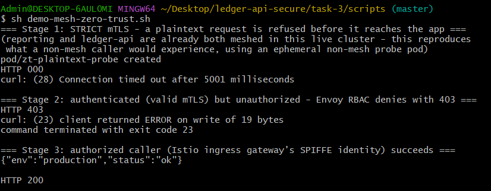
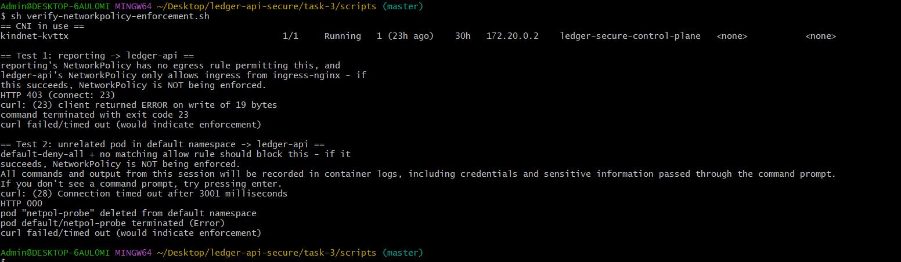
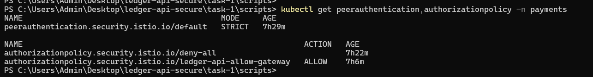

# Task 3 — Service Mesh & Zero-Trust (Istio)

Brings `ledger-api` and its `reporting` neighbour into an Istio mesh:
STRICT mTLS everywhere, identity-based (SPIFFE) authorization instead of
IP-based rules, and a documented comparison against the NetworkPolicy layer
from Task 1.

See `docs/architecture.md` for the diagram and the technical deep-dives, and
`docs/decisions.md` for every cross-cutting trade-off and why it was made
that way.

## What's live

- **mTLS STRICT** on the `payments` namespace (`PeerAuthentication`) - a
  plaintext request is refused before it reaches the application.
- **Default-deny `AuthorizationPolicy`**, with one explicit, identity-keyed
  exception for the Istio ingress gateway's SPIFFE principal.
- **Both workloads meshed**: `ledger-api` and `reporting` run with injected
  sidecars (Istio's native-Kubernetes-sidecar mechanism + the CNI plugin -
  no privileged in-pod init container).
- **Istio Ingress Gateway** with real TLS termination, replacing
  ingress-nginx as ledger-api's north-south entrypoint (see "Known,
  intentional regression" below for why).
- **Bonus canary**: a genuine second backend (`ledger-api-canary`, its own
  Deployment/Pods, same signed image) taking ~10% of traffic via
  `VirtualService` weighted routing + `DestinationRule` subsets - verified
  with real Envoy request counters, not just applied-and-assumed.

## The three-stage zero-trust proof

No throwaway pods - `reporting` already has no legitimate reason to call
ledger-api's HTTP API (it's a read-only Kubernetes-API observer per its own
RBAC design), which makes it a real, honest "unauthorized caller," not a
contrivance.

| Stage | Setup | Result | Evidence |
|---|---|---|---|
| 1 | Only `ledger-api` meshed, `PeerAuthentication` STRICT. `reporting` (no sidecar) sends plaintext. | **TCP-level refusal** (connection times out) - no identity presented at all. | `docs/screenshots/02-tls-check-strict-plaintext-refused.txt` |
| 2 | `reporting` now meshed too (valid mTLS cert), `deny-all` `AuthorizationPolicy` active. | **HTTP 403 from Envoy's RBAC filter** - a *cryptographically authenticated* mesh member, still denied, purely on identity. | `docs/screenshots/03-authz-deny-reporting-identity.txt` |
| 3 | Istio Ingress Gateway added, explicit `AuthorizationPolicy` ALLOW for its SPIFFE principal. | **HTTP 200**, TLS-terminated at the gateway. | `docs/screenshots/04-authz-allow-gateway-and-canary.txt` |

`istioctl authn tls-check` (named in the assignment) was removed from Istio
years ago (last existed around 1.1); the current equivalent,
`istioctl experimental describe pod`, is used instead and shown in the
stage-1 evidence file.

## NetworkPolicy vs. Istio - genuinely verified, not assumed

Before writing a word of this section, both layers were tested empirically:
`task-3/scripts/verify-networkpolicy-enforcement.sh` proved kind's kindnet
CNI **does** enforce `NetworkPolicy` in this cluster (a real, positive
finding worth stating plainly, since older assumptions about kindnet say
otherwise) - see `docs/screenshots/00-networkpolicy-enforcement-verified.txt`
and `05-networkpolicy-still-independent-layer.txt` (re-verified after the
mesh was fully live, to confirm the layers are genuinely both active, not
one silently superseding the other).

| Layer | Enforced at | Identity model | Catches | Misses |
|---|---|---|---|---|
| NetworkPolicy | Kernel/netfilter (CNI) | Positional (IP, namespace, pod label) | Raw traffic, any protocol; still works if Envoy itself is buggy/bypassed | Identity spoofing - anything landing inside an allowed pod/namespace passes |
| Istio mTLS + AuthorizationPolicy | Userspace sidecar (Envoy), L7 | Cryptographic (SPIFFE, from the mTLS client cert) | Identity spoofing; HTTP-level rules (method/path); travels with the workload regardless of IP | Non-HTTP/non-mesh traffic, hostNetwork pods, anything that bypasses the sidecar entirely |

## Trust root and certificate rotation

`istiod` generates its own self-signed root CA at install time (stored as
`istio-ca-secret` in `istio-system`) - entirely separate PKI from the
Sigstore/Fulcio/Rekor chain that fought the corporate proxy in Tasks 1-2, no
dependency on that connectivity here. Each sidecar's `istio-agent`
authenticates to istiod's CSR endpoint using a dedicated, narrowly-scoped
`istio-token` (audience `istio-ca` - not the pod's normal Kubernetes API
token, so `ledger-api`'s `automountServiceAccountToken: false` design from
Task 1 is untouched), receives a short-lived (~24h) workload certificate
back, and rotates it automatically before expiry with no pod restart. Real,
extracted evidence in `docs/screenshots/06-trust-root-and-workload-cert.txt`
- notice the cert's SPIFFE URI SAN
(`spiffe://cluster.local/ns/payments/sa/ledger-api`) is exactly what
`AuthorizationPolicy` principals key on.

**PCI/CDE honesty note**: a self-signed, cluster-internal root has no
external chain-of-trust or revocation infrastructure behind it - fine for a
lab, not what a real PCI audit of a cardholder-data-environment would
accept as the mesh's root of trust. The production-correct answer is
plugging in an enterprise root/intermediate (e.g. via `cert-manager`'s
`istio-csr`), which is out of scope here but worth stating rather than
implying the default is audit-ready. What Istio's mTLS boundary *does*
legitimately do for CDE scoping: since every in-scope workload now proves
its identity cryptographically on every connection, the mesh boundary
around `payments` becomes a meaningful, enforced network segmentation
control of the kind PCI DSS requires to shrink CDE scope - not just a
namespace label.

## Known, intentional regression to Task 1's ingress demo

Once `payments` is STRICT mTLS, ingress-nginx (no sidecar, plaintext) can no
longer reach `ledger-api` at all - `task-1/scripts/verify-all.sh`'s
`curl -H "Host: ledger.local" http://127.0.0.1/health` check now fails.
This is correct zero-trust behavior, not a bug: a non-mesh, unauthenticated
caller losing access is exactly what STRICT mTLS is for. The Istio Ingress
Gateway (mesh-native, its own verifiable identity) is the replacement
entrypoint - see `task-3/scripts/demo-mesh-zero-trust.sh` for the working
equivalent. Two alternatives were considered and rejected; see
`docs/decisions.md`.

## Setup

```bash
istioctl install -f task-3/bootstrap/istio-operator.yaml -y
bash task-3/bootstrap/03-create-gateway-tls-secret.sh   # local self-signed cert, never committed
# task-1/k8s/base/namespace.yaml already carries istio-injection: enabled (ArgoCD-applied)
bash task-3/bootstrap/02-label-namespace-injection.sh    # rolls ledger-api + reporting to pick up sidecars
kubectl apply -f task-3/gitops/application-mesh-policy.yaml   # ArgoCD Application -> task-3/k8s/mesh
```

## Show it working

```bash
bash task-3/scripts/verify-networkpolicy-enforcement.sh
bash task-3/scripts/demo-mesh-zero-trust.sh
```

Screenshots, `screenshots/`:


*Plaintext refused (no identity) → authenticated but 403 (denied by identity) → gateway succeeds with 200.*


*Both the unauthorized `reporting` call and an unrelated pod's call to `ledger-api` time out; kindnet genuinely enforces NetworkPolicy on this cluster.*


*STRICT mTLS plus the default-deny and ingress-gateway-allow policies, applied in `payments`.*

All screenshots referenced above are real, captured command output from this
exact cluster - not illustrative examples.
