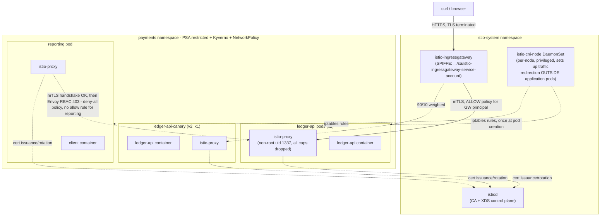

# Architecture

## How a request actually flows (authorized path)

1. Client sends HTTPS to the gateway's forwarded port; the gateway
   terminates TLS using the `ledger-local-tls` secret (self-signed, local
   only - see `bootstrap/03-create-gateway-tls-secret.sh`).
2. The gateway's own Envoy re-encrypts the connection as Istio mTLS to
   `ledger-api`, presenting its SPIFFE identity
   (`cluster.local/ns/istio-system/sa/istio-ingressgateway-service-account`).
3. `ledger-api`'s sidecar validates the mTLS handshake (satisfies
   `PeerAuthentication` STRICT), then checks the caller's principal against
   `AuthorizationPolicy` rules - the gateway has an explicit ALLOW, so the
   request reaches the application container.
4. NetworkPolicy already permitted this at L3/L4 (ingress from the
   `istio-system` namespace) - both layers agree, independently.

## How `reporting`'s request is blocked, and why it's two different failure modes

- **Before `reporting` had a sidecar** (stage 1): its plaintext SYN/HTTP
  request hits `ledger-api`'s Envoy inbound listener, which is configured
  for mTLS-only. There's no valid TLS/mTLS handshake to even attempt RBAC
  evaluation against - the connection is refused outright. From the
  client's view this is indistinguishable from "nothing is listening":
  a timeout, not an HTTP error.
- **After `reporting` had a sidecar** (stage 2): the mTLS handshake now
  succeeds - `reporting` presents a valid, istiod-issued certificate with
  SPIFFE identity `cluster.local/ns/payments/sa/reporting`. Envoy accepts
  the connection at the transport layer, decrypts the HTTP request, and
  *then* evaluates it against the `deny-all` + `ledger-api-allow-gateway`
  `AuthorizationPolicy` rules. `reporting`'s principal matches no ALLOW
  rule, so Envoy's RBAC filter returns `403` - an explicit, informative
  HTTP-level denial, because the identity was real and verified, just not
  entitled.

This is the concrete, testable difference between "not authenticated" and
"authenticated but not authorized" that identity-based zero-trust is
supposed to produce.

## NetworkPolicy interactions that required real fixes, not just docs

Bringing sidecars into `payments` genuinely broke things that had to be
fixed with real NetworkPolicy egress/ingress rules, not just described:

- `istio-proxy`'s certificate-issuance calls to `istiod` (ports
  15010/15012/15014) were blocked by the existing default-deny posture
  until explicitly allowed - see `task-1/k8s/base/networkpolicy-ledger-api.yaml`
  and `networkpolicy-reporting.yaml`.
- `reporting` needed an explicit L3/L4 allow to `ledger-api:8080` so that
  the Task 3 identity-based deny (stage 2) is unconfounded by the
  network-layer policy also blocking the same path - otherwise the demo
  would prove nothing about *which* layer did the blocking.

## Resource-constrained single-node lab cluster

Every pod in `payments` now carries a second (or third, counting
`istio-validation`) container. On this lab's single kind node, memory
requests hit ~97% allocated even before adding the canary Deployment -
`ledger-api` was reduced from 3 to 2 replicas to make room (documented in
`docs/decisions.md`; not a security-relevant change). A production cluster
would simply add nodes; this is a known, stated constraint of running the
entire assignment on one local machine with no cloud account.
